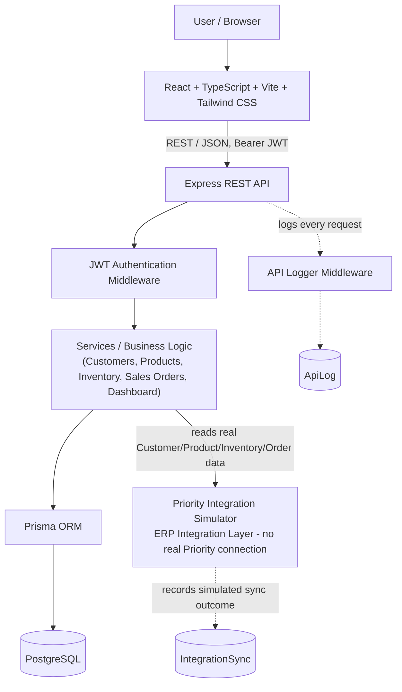
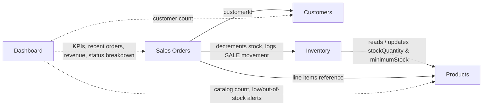

# ERP Sales & Inventory Integration Platform

## 🇮🇱 הסבר בעברית

### מהו האתר?

זוהי מערכת **Full-Stack** שמדמה מערכת **ERP** (מערכת לניהול משאבי ארגון) לניהול לקוחות, מוצרים, מלאי והזמנות מכירה — בדומה למערכות עסקיות אמיתיות (כמו Priority, SAP ואחרות), אך כפרויקט הדגמה עצמאי לתיק עבודות.

### מה אפשר לעשות במערכת?

- התחברות והרשמה של משתמשים, עם אימות מאובטח
- ניהול לקוחות — הוספה, עריכה, מחיקה וחיפוש
- ניהול מוצרים — קטלוג, מחירים, קטגוריות, סטטוס מלאי
- ניהול מלאי — מעקב אחר כמויות, עדכון מלאי, והיסטוריית תנועות מלאי
- יצירת וניהול הזמנות מכירה — עם בדיקת מלאי אמיתית וחישוב מחירים בצד השרת
- **Dashboard** עם נתונים אמיתיים (לא מומצאים) — מדדים, גרפים, והתראות מלאי
- **API Logs** — תיעוד אוטומטי של כל קריאה למערכת, לצורכי מעקב ובקרה
- **Priority Integration Simulator** — הדגמה של סנכרון מידע למערכת ERP חיצונית
- מעקב אחר פעולות וסנכרונים שבוצעו במערכת (היסטוריית Sync)

### איך המערכת עובדת (בקצרה)?

```
Frontend (מסך המשתמש)
        ↓
REST API (השרת)
        ↓
Business Logic (הלוגיקה העסקית)
        ↓
Prisma (שכבת הגישה למסד הנתונים)
        ↓
PostgreSQL (מסד הנתונים)
```

כשמשתמש מבצע פעולה במסך — למשל יצירת הזמנה חדשה — הבקשה עוברת מה-Frontend לשרת. השרת מוודא הרשאות ותקינות נתונים, מפעיל את הלוגיקה העסקית המתאימה (למשל בדיקת זמינות מלאי), וכל שינוי נשמר במסד הנתונים דרך Prisma.

### על האינטגרציה ל-ERP (Priority Integration Simulator)

המערכת כוללת מודול שמדגים כיצד ניתן לסנכרן מידע — לקוחות, מוצרים, מלאי והזמנות — בין המערכת הזו לבין מערכת ERP חיצונית, בדומה לתהליכי אינטגרציה שקיימים בעולם האמיתי מול מערכות כגון Priority.

**חשוב להבהיר: מדובר בסימולטור בלבד.** המערכת **אינה** מתחברת בפועל לשום מערכת Priority אמיתית, ואינה שולחת מידע לשום מערכת חיצונית. כל "הסנכרון" מתבצע מול הנתונים הקיימים כבר במסד הנתונים המקומי של הפרויקט, ומטרתו להדגים הבנה של ארכיטקטורת אינטגרציה — לא חיבור אמיתי למוצר Priority.

### טכנולוגיות בשימוש

React, TypeScript, Vite, Tailwind CSS, Node.js, Express, Prisma, PostgreSQL, JWT, bcrypt, Vitest, Supertest, Playwright, Swagger/OpenAPI.

### למה הפרויקט נבנה?

מטרת הפרויקט להדגים יכולות פיתוח Full-Stack מקצה לקצה: עבודה עם REST APIs, מסדי נתונים, אימות משתמשים (Authentication), לוגיקה עסקית מורכבת, ניהול מלאי, תהליכי מכירה, ותבניות אינטגרציה בין מערכות — כפי שנדרש בפרויקטים עסקיים אמיתיים.

### 🎯 מה הפרויקט מדגים מבחינה מקצועית

- פיתוח Full-Stack (Frontend + Backend + Database)
- בניית REST API מלא
- עבודה עם מסד נתונים PostgreSQL
- ניהול נתונים ומיפוי טבלאות באמצעות Prisma ORM
- Authentication והרשאות גישה (JWT, bcrypt)
- שימוש ב-Transactions לשמירה על תקינות הנתונים
- טיפול נכון במלאי ובעדכוני מלאי
- תהליכי מכירה מלאים (Order Lifecycle)
- API Logging ומעקב אחר פעילות המערכת
- דפוסי אינטגרציה (Integration Patterns) בין מערכות
- בדיקות אוטומטיות (Unit / Integration / End-to-End)

---

A full-stack, portfolio-grade ERP web application for managing **Customers**, **Products**, **Inventory**, and **Sales Orders**, with a live **Dashboard**, an automatically-recorded **API Logs** audit trail, and a **Priority Integration Simulator** that demonstrates ERP/Priority-style integration architecture.

> **Important — Priority Integration Simulator**
> This project does **not** connect to a real Priority ERP system. The "Priority Integration" module is a **simulator/demo** built entirely on top of this application's own PostgreSQL data. Every screen and API response in that module is labeled **"Priority Integration Simulator"** / **"Simulated ERP connection"**, and no outbound network call is ever made to any external Priority instance. See the [Disclaimer](#disclaimer) section below.

---

## Table of Contents

- [Overview](#overview)
- [Key Features](#key-features)
- [Tech Stack](#tech-stack)
- [Architecture](#architecture)
- [Main Modules](#main-modules)
- [Business Logic](#business-logic)
- [API Documentation](#api-documentation)
- [Testing](#testing)
- [Security](#security)
- [Local Development](#local-development)
- [Demo Credentials](#demo-credentials)
- [Project Structure](#project-structure)
- [Screenshots](#screenshots)
- [Future Improvements](#future-improvements)
- [Disclaimer](#disclaimer)

---

## Overview

This project simulates the sales-and-inventory side of an ERP system, end to end:

- **Customers** — full CRUD with search and pagination.
- **Products** — catalog CRUD with search, category/stock-status filtering, and sorting.
- **Inventory** — stock-level view, manual stock adjustments, and a per-product movement history.
- **Sales Orders** — order creation with real, server-side stock validation and atomic transactions, plus a status lifecycle.
- **Dashboard** — live KPIs, a sales-over-time chart, an orders-by-status breakdown, recent orders, and inventory alerts — all computed from real data, never hardcoded.
- **API Logs** — every API request is recorded automatically (method, endpoint, status, timing, caller) for auditing.
- **Priority Integration Simulator** — a dedicated module that demonstrates how this system's real data could be mapped to Priority-style Integration DTOs and synced to an external ERP, entirely simulated.

## Key Features

- JWT-based authentication with registration, login, logout, and protected routes.
- Full Customer, Product, Inventory, and Sales Order management (create, read, update where applicable, delete with referential-integrity guards).
- Server-authoritative order totals (subtotal, VAT, total) — the client never computes final prices.
- Atomic, stock-checked order creation with automatic rollback on insufficient stock.
- Inventory movement history (`SALE`, `ADJUSTMENT`, etc.) tied to real stock changes.
- Live Dashboard: KPI cards, a real sales-over-time chart, an orders-by-status chart, recent orders, and low/out-of-stock alerts.
- Automatic API request logging with search, filtering, and a details view — never logs passwords, JWTs, or Authorization headers.
- Priority Integration Simulator: simulated Customer/Product/Inventory/Order sync runs, an integration history log, and a details view showing the mapped Integration DTO payload.
- Interactive Swagger/OpenAPI documentation for the entire REST API.
- Responsive UI (mobile, tablet, desktop) with a consistent design system across every module.

## Tech Stack

**Frontend**
- React
- TypeScript
- Vite
- Tailwind CSS

**Backend**
- Node.js
- Express
- TypeScript
- JWT (`jsonwebtoken`)
- bcrypt

**Database**
- PostgreSQL
- Prisma (ORM + migrations)

**Testing**
- Vitest
- Supertest
- Playwright

**API**
- REST
- Swagger / OpenAPI (`swagger-ui-express`)

## Architecture

### System overview

The main request path (`User → Client → API → Auth → Business Logic → ORM → Database`), plus two cross-cutting concerns that run alongside it: automatic API request logging, and the Priority Integration Simulator.



Both the API Logger and the Priority Integration Simulator are **read-only observers** of the core business tables — neither one ever mutates Customer, Product, Order, or Inventory data. The Simulator never makes an outbound network call; it only reads this application's own PostgreSQL data through the same Prisma layer as every other module.

### Module relationships

How the five core business modules relate to each other and to the underlying data:



`Inventory` is not a separate table — it is a live view over each `Product`'s `stockQuantity` / `minimumStock`, backed by an `InventoryMovement` audit trail. `Dashboard` is a read-only aggregator: it never owns data, it only reads from Customers, Products, and Orders.

## Main Modules

| Module | Description |
|---|---|
| **Authentication** | Register/login with JWT issuance, bcrypt-hashed passwords, and protected client-side routes. |
| **Customers** | Full CRUD, search by name/email/customer number, pagination. |
| **Products** | Full CRUD, search by name/SKU, category and stock-status filters, sorting. |
| **Inventory** | Read-only stock view derived from Products, manual stock-quantity adjustments, and per-product movement history. |
| **Sales Orders** | Order creation (customer + line items), real-time stock validation, order details, and status updates (Draft → Pending → Confirmed → Shipped → Completed / Cancelled). |
| **Dashboard** | Real-time KPIs, sales-over-time chart, orders-by-status chart, recent orders, and low/out-of-stock alerts. |
| **API Logs** | Automatically recorded history of every API request, with search, filters, and a details view. |
| **Priority Integration Simulator** | Simulated sync of real Customers/Products/Inventory/Orders to a Priority-style external system, with a full run history and Integration DTO payload details. |

## Business Logic

- **Atomic order creation** — creating an order (customer + line items) runs inside a single Prisma transaction: stock is checked and decremented, order + order items are created, and an `InventoryMovement` row is written, all together.
- **Stock validation** — if any line item's requested quantity exceeds available stock, the entire transaction is rolled back: **no** order is created, **no** stock is decremented, and **no** movement record is written for that order.
- **Inventory movements** — a movement row is only ever created when stock actually changes (a `SALE` on order creation, an `ADJUSTMENT` on a manual inventory update); no movement is recorded for a failed order or a no-op stock edit.
- **Decimal / money calculations** — prices, subtotals, VAT, and totals are stored and computed as SQL `Decimal` values (via Prisma), never floating-point numbers, to avoid rounding drift.
- **Order status workflow** — orders move through `DRAFT → PENDING → CONFIRMED → SHIPPED → COMPLETED` or `CANCELLED` via a dedicated status-update endpoint.
- **Transaction rollback** — every multi-step write (order creation, stock adjustments) uses a database transaction so partial failures never leave inconsistent data.
- **API logging** — a middleware records every `/api/*` request (method, endpoint, status code, response time, authenticated caller) before the response is sent, and captures the error message on failures — without ever logging request bodies, headers, or the `Authorization` header.
- **Integration sync (simulated)** — each simulated sync reads real Customer/Product/Inventory/Order rows, maps them to a Priority-style Integration DTO, and records the outcome (`SUCCESS` / `PARTIAL` / `FAILED`) in its own history table; it never writes back to business data.

## API Documentation

Interactive Swagger/OpenAPI documentation is served directly by the backend at:

```
/api-docs
```

With the backend running locally, open **http://localhost:4000/api-docs**.

## Testing

**Backend automated tests** (Vitest + Supertest, run against a real PostgreSQL database):

```
npm test   (from server/)
```

Most recently verified: **96/96 tests passing** across 7 test files (auth, customers, products, inventory, orders, logs, and the Priority Integration simulator).

**Production builds:**
- `server`: `npm run build` (TypeScript, `strict: true`) — verified with **0 build errors**.
- `client`: `npm run build` (TypeScript + Vite) — verified with **0 build errors**.

**End-to-end testing:** the application's core flows (login, registration, logout, Customers, Products, Inventory, Sales Orders, Dashboard, API Logs, and the Priority Integration Simulator) were exercised with Playwright against the real running frontend, backend, and PostgreSQL database during development and QA — including unauthorized-access redirects, full CRUD flows, the insufficient-stock rollback path, and responsive checks at 390px / 768px / 1280px. These E2E scripts were used as part of the development workflow rather than committed as an automated suite in this repository.

## Security

- **JWT authentication** — all protected endpoints require a valid Bearer token.
- **bcrypt password hashing** — passwords are never stored or logged in plain text.
- **Protected routes** — both the API (middleware) and the frontend (route guards) block unauthenticated access.
- **Environment variables** — secrets and connection strings (`DATABASE_URL`, `JWT_SECRET`) are read from `.env` files, never hardcoded.
- **Sensitive data excluded from logs** — the API Logging middleware never records request bodies, headers, or the `Authorization` header, so passwords and JWTs never appear in `ApiLog`.
- **`.env` excluded from Git** — only `.env.example` templates are committed; real `.env` files are git-ignored.

## Local Development

### Prerequisites
- Node.js
- A local PostgreSQL server

### 1. Install dependencies (from the repo root)

```
npm install
```

### 2. Configure environment variables

Copy the example env files and fill in real local values:

```
server/.env.example  →  server/.env
client/.env.example  →  client/.env
```

`server/.env` needs at least `DATABASE_URL` (your local PostgreSQL connection string) and `JWT_SECRET`.
`client/.env` needs `VITE_API_URL` (defaults to `http://localhost:4000`).

### 3. Run Prisma migrations

```
cd server
npx prisma migrate dev
```

### 4. Seed the database

```
npx prisma db seed
```

This creates the demo user and realistic sample Customers, Products, and Orders.

### 5. Run the backend

```
npm run dev -w server
```

Backend runs at **http://localhost:4000** (Swagger docs at `/api-docs`).

### 6. Run the frontend

```
npm run dev -w client
```

Frontend runs at **http://localhost:5173**.

> From the repository root, `npm run dev` starts **both** the backend and frontend together (via `concurrently`).

## Demo Credentials

For local demo purposes only — **not real secrets**, and only valid against your own locally seeded database:

```
Email:    demo@example.com
Password: Demo1234!
```

You can also register a new account from the app's `/register` page.

## Project Structure

```
erp-sales-inventory-platform/
├── client/                      # React + TypeScript + Vite frontend
│   ├── src/
│   │   ├── api/                 # Typed API client modules (one per resource)
│   │   ├── auth/                # Auth context + protected route guard
│   │   ├── components/          # Shared UI, layout, and per-feature components
│   │   ├── hooks/                # Shared React hooks (debounce, etc.)
│   │   ├── lib/                 # Formatting and shared helpers
│   │   ├── pages/                # One page per route (Dashboard, Customers, Products, ...)
│   │   ├── services/             # Cross-resource aggregation (e.g. dashboard data)
│   │   └── types/                # Shared TypeScript types
│   └── ...
├── server/                      # Express + TypeScript backend
│   ├── src/
│   │   ├── config/               # Prisma client, constants
│   │   ├── controllers/          # Thin request handlers
│   │   ├── docs/                 # OpenAPI/Swagger schema definitions
│   │   ├── middleware/           # Auth, validation, error handling, API logging
│   │   ├── routes/               # Express routers, one per resource
│   │   ├── services/             # Business logic
│   │   ├── utils/                # Shared helpers (JWT signing, error mapping, etc.)
│   │   └── validators/           # Zod request-validation schemas
│   ├── prisma/
│   │   ├── schema.prisma         # Database schema
│   │   ├── migrations/           # Prisma migration history
│   │   └── seed.ts               # Demo data seed script
│   └── tests/                    # Vitest + Supertest backend test suites
└── package.json                  # Root workspace scripts
```

## Screenshots

_Screenshots of the Dashboard, Customers, Products, Inventory, Sales Orders, API Logs, and Priority Integration screens will be added here._

## Future Improvements

- A real Priority (or other ERP) integration, replacing the current simulator with an actual outbound connector.
- Cloud deployment (e.g., containerized backend + managed PostgreSQL + static frontend hosting).
- CI/CD pipeline running the backend test suite and both production builds on every push.
- Role-based access control beyond the existing `ADMIN` / `USER` roles.
- An automated, repository-committed Playwright E2E suite (building on the manual QA scripts used during development).

## Disclaimer

The Priority integration in this project is a **simulator/demo** and does **not** connect to a real Priority system. It is intended solely to demonstrate ERP integration architecture and data-mapping patterns using this application's own local data.
